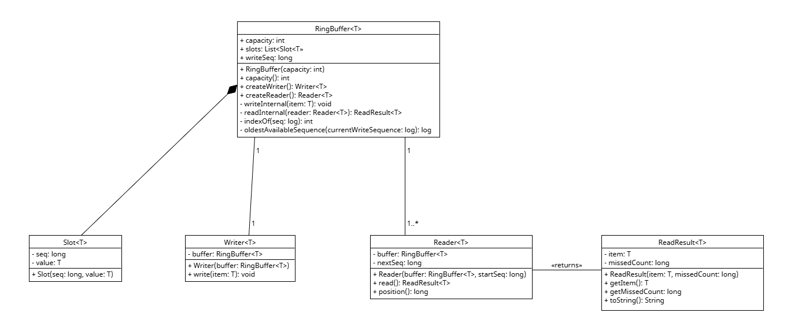
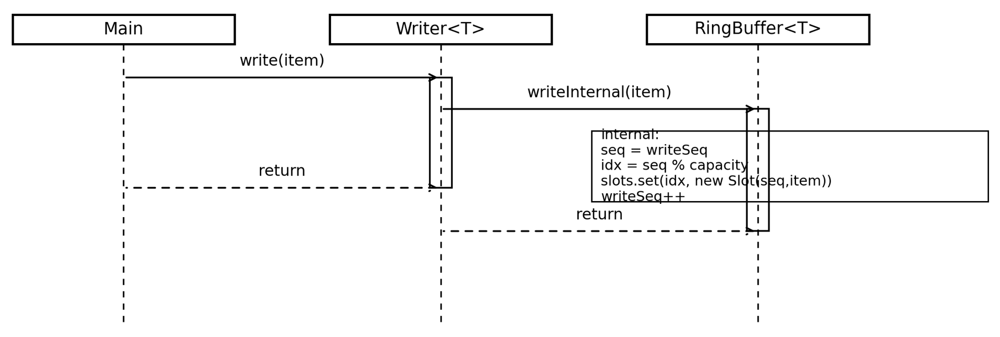
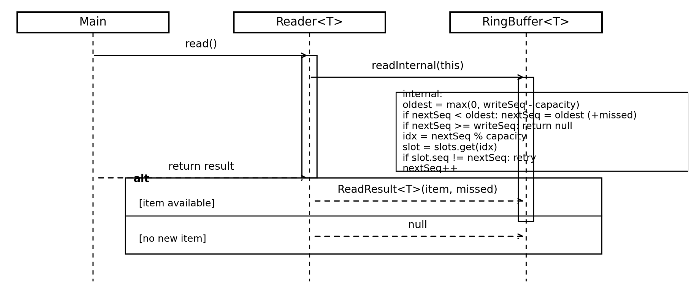

# Ring Buffer Implementation

**Name:** Asgar Huseynli  
**ID:** 17683  
**Course:** Object-Oriented Analysis & Design  
**Assignment 2 – Ring Buffer**

---

## 1. Project Overview

This project implements a **generic fixed-capacity Ring Buffer** in Java.

A ring buffer is a circular data structure that:

- Has a fixed capacity `N`
- Overwrites the oldest data when full
- Supports one writer
- Supports multiple independent readers
- Does not remove data when read

Each reader maintains its own position, and slow readers may miss items due to overwriting.

The implementation follows proper Object-Oriented design principles and avoids a monolithic class structure.

---

## 2. Design Explanation

The design separates responsibilities across multiple classes.

### RingBuffer<T>

The core data structure responsible for:

- Managing fixed-capacity storage
- Maintaining the global write sequence (`writeSeq`)
- Calculating circular indices
- Detecting overwritten data
- Creating `Writer` and `Reader` objects

---

### Writer<T>

Responsible for writing elements into the buffer.

- Delegates writing logic to `RingBuffer`
- Ensures non-null writes
- One writer per buffer (as required)

---

### Reader<T>

Represents an independent consumer.

- Maintains its own sequence (`nextSeq`)
- Reads available items
- Detects missed elements
- Does not affect other readers

---

### ReadResult<T>

Encapsulates the result of a read operation:

- The item read
- Number of missed items

---

### Slot<T> (Private)

Internal storage unit containing:

- Sequence number
- Value

It is private because it is an implementation detail of `RingBuffer`.

---

### Design Principles

- Encapsulation
- Single Responsibility Principle
- Separation of concerns
- Generic, type-safe implementation

---

## 3. Diagrams

### UML Class Diagram



---

### UML Sequence Diagram for write() Function



---

### UML Sequence Diagram for read() Function



---

## 4. How to Run the Project

### Requirements

- Java 11 or higher
- Any Java IDE (IntelliJ IDEA, Eclipse, VS Code)  
  or command line terminal

---

### Option 1 – Using an IDE

1. Open the project in your IDE.
2. Locate `Main.java`.
3. Run the `Main` class.
4. View the output in the console.

---

### Option 2 – Using Command Line

1. Navigate to the directory containing the `.java` files.

2. Compile the project:

```bash
javac RingBuffer.java Main.java